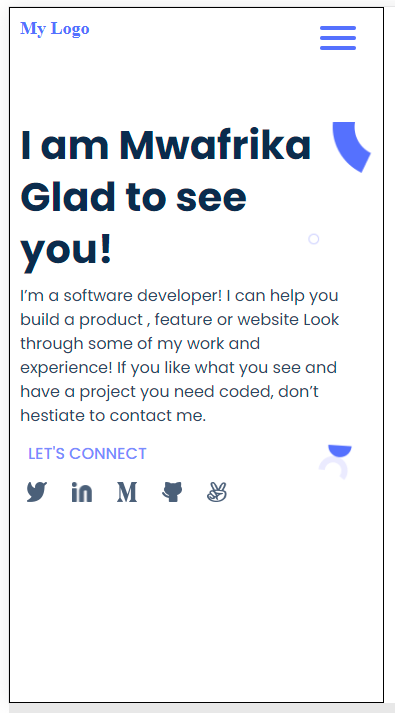

# Basic portofolio project

> This is the very first project at Microverse that initiate students on how to use Git/Github and Linting for their projects

## Built With

- HTML and CSS

## Getting Started

**In this project, students at Microverse will get familiar with CSS, HTML, git/github/github flow and linting**

To get a local copy up and running follow these simple example steps.

### Prerequisites

#### Have nodejs an npm installed locally

### Setup

#### To get the copy of this project, please go ahead and clone the project from the source repository and run `git clone https://github.com/mwafrika/portfolio-microverse.git`

#### Next step is to open the cloned repository and run the following command to install the project dependencies locally `npm install` in

### Usage

#### run the following command to fix the linting errors

` npm run fix`

## Authors

👤 **Author**

- GitHub: [@github](https://github.com/mwafrika)
- Twitter: [@twitter](https://twitter.com/mwafrikamufung1)
- LinkedIn: [LinkedIn](https://www.linkedin.com/in/mwafrika-mufungizi)

## Show your support

Give a ⭐️ if you like this project!

## Acknowledgments

- Hat tip to anyone whose code was used
- Inspiration
- etc

## 📝 License

This project is [MIT](./MIT.md) licensed.
