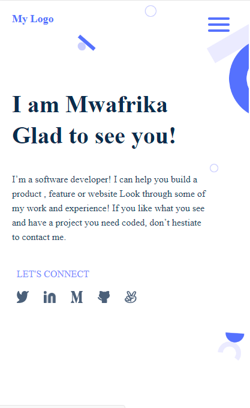

# Basic portofolio project

> This is the very first project at Microverse that initiate students on how to use Git/Github and Linting for their projects

## Built With

- HTML and CSS

## Getting Started

**Portofolio Project**
**In this project, students at Microverse will get familiar with CSS, HTML, git/github/github flow and linting**

To get a local copy up and running follow these simple example steps.

### Prerequisites

### Setup

##### create .github/workflows folder in your first commit for the feature branch then add a copy of [.github/workflows/linters.yml](https://github.com/microverseinc/linters-config/blob/master/html-css/.github/workflows/linters.yml) to the created folder

#### run `npm init -y` to initialize your project with npm

### Install

` npm install --save-dev hint@6.x`

`npx hint .`

`npm install --save-dev stylelint@13.x stylelint-scss@3.x stylelint-config-standard@21.x stylelint-csstree-validator@1.x`

### Usage

#### run the following command to fix the linting errors

` npx stylelint "**/*.{css,scss}"`

## Authors

👤 **Author**

- GitHub: [@github](https://github.com/mwafrika)
- Twitter: [@twitter](https://twitter.com/mwafrikamufung1)
- LinkedIn: [LinkedIn](https://www.linkedin.com/in/mwafrika-mufungizi)

## Show your support

Give a ⭐️ if you like this project!

## Acknowledgments

- Hat tip to anyone whose code was used
- Inspiration
- etc

## 📝 License

This project is [MIT](./MIT.md) licensed.
